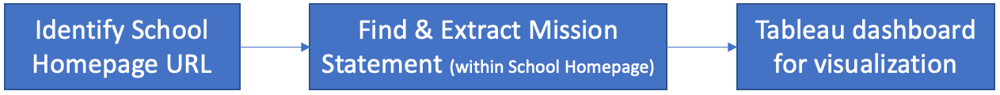

# School Text

School Text project aims to capture K-12 schools' mission statements to analyze if it is aligned with district's mission and conduct other analysis on top of it.

### Getting started

For your convenience, each tool has a separate set of packages list that you can choose to install instead of one, large package list. To get started with a specific tool, see the `README.md` file located in the specific tool's folder.

You can also find entire package list in the `project root` directory.

#### Prerequisites

Tools are supported on Python 3.6 or later

### Process Overview

