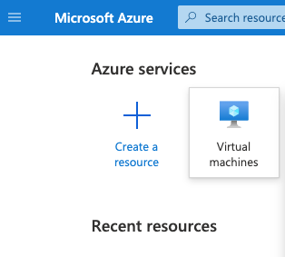
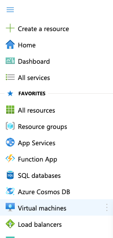
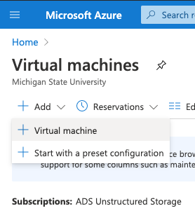
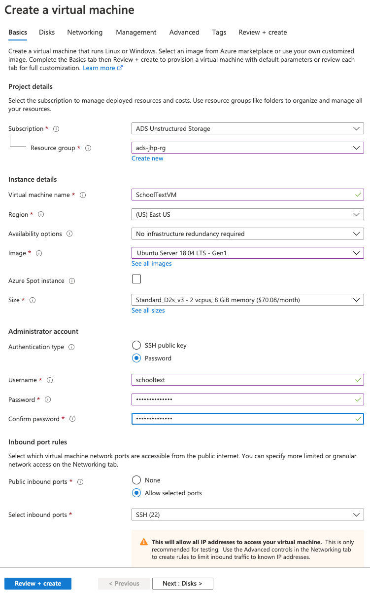
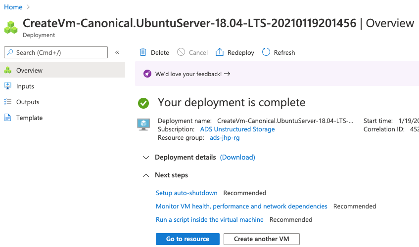
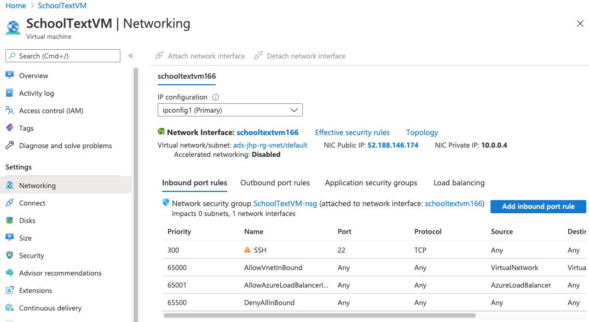
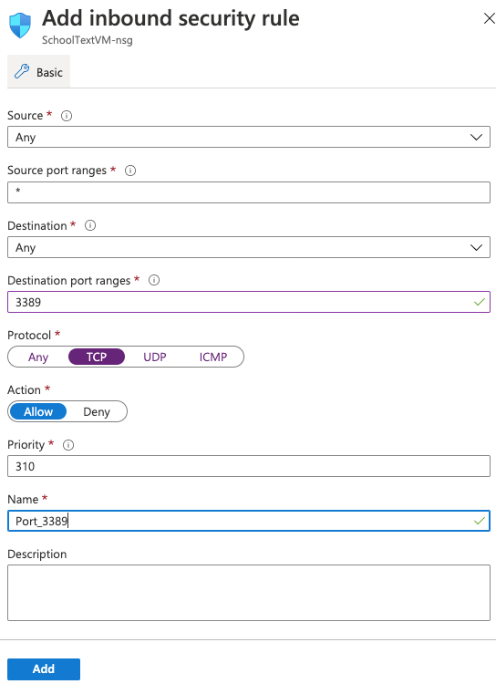

# Azure Ubuntu VM for Classification

This step-by-step instruction covers prepping Azure Ubuntu VM for the school homepage classification.

### Creating Azure VM with Ubuntu image

------

**1. From Azure portal, click "Virtual machines" from Azure services**

    				 

**2. Click "Add" and select "Virtual machine"**

 

**3. Complete the form using following instruction**

   - Subscription
     - For ADS, it should be "ADS Unstructured Storage"
   - Resource group
     - Select your resource group if you have already created one from any previous activities OR create one
     - If you are to create one please follow this convention
       - [dept]-[your netID]-[testing/prod]-rg
       - (e.g.,) ads-jhp-testing-rg
   - Virtual machine name
     - You may name anything but suggest something that reflects your project
       - (e.g.,) SchoolTextVM
   - Region
     - East US (default) is fine unless you have other requirements
   - Availability
     - Default is fine (No infrastructure redundancy required)
   - Image
     - Ubuntu Server 18.04 LTS - Gen 1 (current at the time of writing 01/19/2021)
   - Size
     - Default is fine (Standard_D2s_v3 - 2 vcpus, 8 GiB memory - $70.08/month - 01/19/2021)
   - Authentication type
     - Password
   - Username
     - Something that is easy to remember and you can share with others but not extremely easy
       - (e.g.,) schooltext
   - Password
     - Something that is easy to remember and you can share with others but not extremely easy
       - (e.g.,) SchoolText2021
   - Public inbound ports
     - Allow selected ports
   - Select inbound ports
     - SSH (22)
   - CLICK "Review + create"

  

**4. Check "Validation passed" banner and click "Create"** 

   - Once completed then click "Go to resource"

  


**5. Click "Networking" (just under the "Settings") from the side bar and then click "Add inbound port rule"**

  

**6. Need to open port 3389 in order to support "Remote Desktop Protocol" (RDP) access. Follow instruction below to add a new inbound security rule to open port 3389, then click "Add"**

   - Source: Any
   - Source port ranges: *
   - Destination: Any
   - Destination port ranges: 3389
   - Protocol: TCP
   - Action: Allow
   - Priority: default is fine (310)
   - Name: Port_3389

  

**7. (Optional) Setup SSH public key for passwordless access**

- Generate RSA key using `ssh-keygen` command

```bash
$ ssh-keygen -t rsa
Generating public/private rsa key pair.
Enter file in which to save the key (/Users/jhp/.ssh/id_rsa): 
Enter passphrase (empty for no passphrase): 
Enter same passphrase again: 
Your identification has been saved in /Users/jhp/.ssh/id_rsa.
Your public key has been saved in /Users/jhp/.ssh/id_rsa.pub.
The key fingerprint is:
SHA256:zF9gZDW5tcIiMDv04wj5BftlK1oauItTlWH3uyPfALc jhp@JP-MBP-CA.local
The key's randomart image is:
+---[RSA 3072]----+
|          o.o.   |
|      B .o  ...  |
|     + @ .o. o . |
|    o *o=.=.+ .  |
|     = *S=.+..   |
|    o + =+oo     |
|   . . = .E.     |
|  ... o . oo     |
|  ....   o...    |
+----[SHA256]-----+
```

- Generated RSA key pair should be in the `.ssh` directory inside your `home` directory

```bash
$ cd ~/.ssh
$ ls -l
total 24
-rw-------  1 jhp  staff   2.5K Jan 20 12:21 id_rsa
-rw-r--r--  1 jhp  staff   573B Jan 20 12:21 id_rsa.pub
-rw-r--r--  1 jhp  staff   174B Jan 11 10:16 known_hosts
```

- Open public key file `id_rsa.pub` and copy its contents
- Access Azure VM using `ssh` command and type **yes** to host key checking; then type password that was setup during VM creation period

```bash
$ ssh schooltext@52.188.146.174
The authenticity of host '52.188.146.174 (52.188.146.174)' can't be established.
ECDSA key fingerprint is SHA256:Ifkug194h7MG8e+bZNNoFRzBZMj7jhQ4uquLc0ziUjg.
Are you sure you want to continue connecting (yes/no/[fingerprint])? yes

Warning: Permanently added '52.188.146.174' (ECDSA) to the list of known hosts.
schooltext@52.188.146.174's password: 

Welcome to Ubuntu 18.04.5 LTS (GNU/Linux 5.4.0-1036-azure x86_64)
(...)
```

- Go to `.ssh` directory inside your `home` directory and open **authorized_keys** file to paste your public key file contents copied from your machine

```bash
$ cd ~/.ssh
$ ls -l
total 0
-rw------- 1 schooltext schooltext 0 Jan 20 23:17 authorized_keys

$ echo "ssh-rsa AAAAB3NzaC1...SIWE= jhp@JP-MBP-CA.local" >> authorized_keys
```

- Now you can ssh into Azure VM without typing password