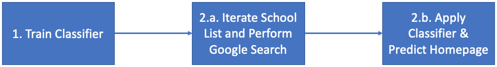

# School Homepage Classification

School homepage classification aims to find correct school homepages from Google Search results using natural language processing (NLP) and machine learning (ML) techniques.  

### Process Overview

------

#### 1. Train Classifier

This component uses both school homepage (positive) and other non-school webpage (negative) dumps to prep text data training Random Forest (RF) classifier. Stratified 10-fold cross validation is used to avoid overfitting.

#### 2.a. Iterate School List and Perform Google Search

This component exploits [Selenium](https://selenium-python.readthedocs.io/) web automation technique to perform Google Search using school name, school city, and school zip code extracted from [National Center for Education Statistics](https://nces.ed.gov/) (NCES).

#### 2.b. Apply Classifier and Predict School Homepage

This component extracts text from the candidate webpages retrieved from Google Search result and apply same NLP techniques to prep text. Once texts are prepped for all webpages, pre-trained RF classifier is utilized to predict School Homepage.

### Example Usage

------

#### 1. Train Classifier

Requires ***THREE*** arguments

- **pos_dir_or_file** (str): Absolute path to school homepage (positive) dump directory or list file
- **neg_dir_or_file** (str): Absolute path to non-school webpage (negative) dump directory or list file
- **model_dir** (str): Absolute path to the output directory where trained classifier will reside

If any of them is missing, program shows error messages with usage.