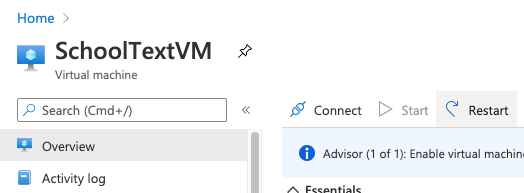
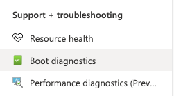
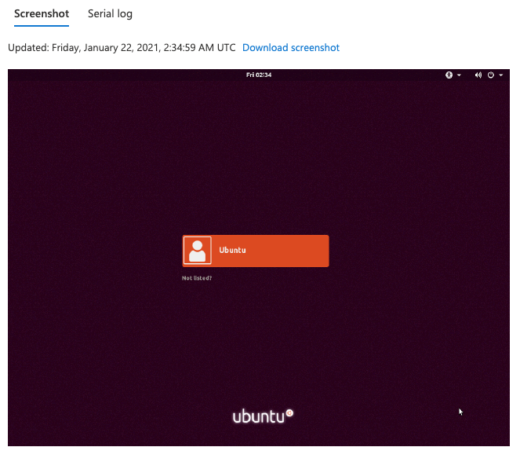
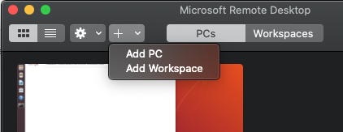
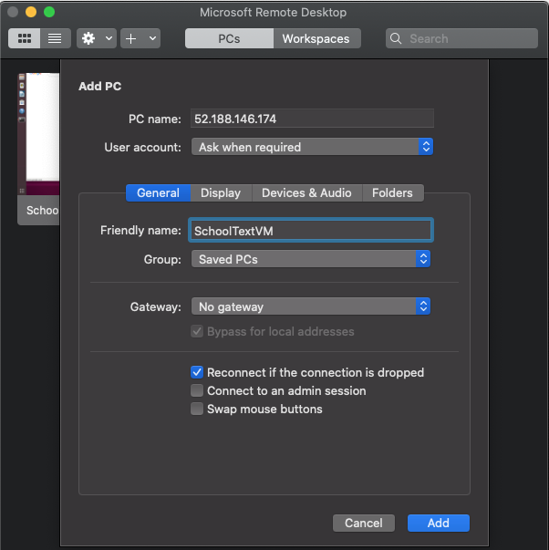
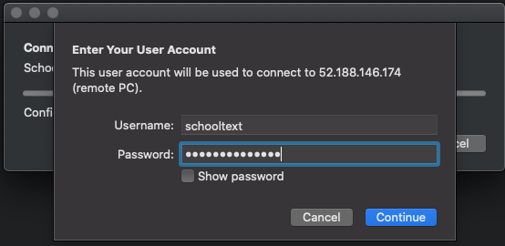
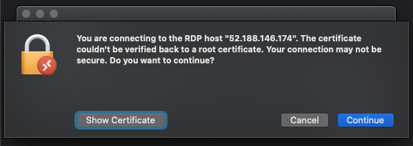

# Azure Ubuntu VM for Classification (2/3)

This instruction covers setting up Remote Desktop (RDP) access on Azure Ubuntu VM (Ubuntu 18.04 LTS)

### Setup Remote Desktop (RDP) access on Azure Ubuntu VM

------

> NOTE: This instruction assumes that Azure VM is setup with Ubuntu 18.04 LTS image following ***"[Creating Azure VM with Ubuntu image](AzureVM.md)"*** instruction

1. Connect Azure Ubuntu VM via ssh. Update Ubuntu repositories and package list then perform upgrade if updates are available

```bash
$ sudo apt update
Hit:1 http://azure.archive.ubuntu.com/ubuntu bionic InRelease
Get:2 http://azure.archive.ubuntu.com/ubuntu bionic-updates InRelease [88.7 kB]
Get:3 http://azure.archive.ubuntu.com/ubuntu bionic-backports InRelease [74.6 kB]
Get:4 http://security.ubuntu.com/ubuntu bionic-security InRelease [88.7 kB]
Get:5 http://azure.archive.ubuntu.com/ubuntu bionic-updates/universe amd64 Packages [1707 kB]
Get:6 http://azure.archive.ubuntu.com/ubuntu bionic-updates/universe Translation-en [360 kB]
Fetched 2320 kB in 1s (3129 kB/s)                                                        
Reading package lists... Done
Building dependency tree       
Reading state information... Done
17 packages can be upgraded. Run 'apt list --upgradable' to see them.

$ sudo apt upgrade
Reading package lists... Done
Building dependency tree       
Reading state information... Done
Calculating upgrade... Done
The following packages will be upgraded:
  cloud-init grub-common grub-efi-amd64-bin grub-efi-amd64-signed grub-pc grub-pc-bin grub2-common libnss-systemd libpam-systemd libsystemd0 libudev1
  linux-cloud-tools-common linux-tools-common sosreport systemd systemd-sysv udev
17 upgraded, 0 newly installed, 0 to remove and 0 not upgraded.
Need to get 9669 kB of archives.
After this operation, 30.7 kB of additional disk space will be used.
Do you want to continue? [Y/n] y
Get:1 http://azure.archive.ubuntu.com/ubuntu bionic-updates/main amd64 libnss-systemd amd64 237-3ubuntu10.44 [105 kB]
Get:2 http://azure.archive.ubuntu.com/ubuntu bionic-updates/main amd64 libsystemd0 amd64 237-3ubuntu10.44 [209 kB]
(...)
```

2. After update process completes, restart the Azure VM by clicking `Restart` from Azure Portal

 

3. Once VM is restarted, connect VM via ssh. Install Unity Desktop GUI. Restart the VM by the Azure Portal.

```bash
$ sudo apt install ubuntu-desktop
Reading package lists... Done
Building dependency tree       
Reading state information... Done
The following additional packages will be installed:
  acpi-support adium-theme-ubuntu adwaita-icon-theme (...)
yelp yelp-xsl zeitgeist-core zenity zenity-common zip
0 upgraded, 1117 newly installed, 0 to remove and 0 not upgraded.
Need to get 592 MB of archives.
After this operation, 2241 MB of additional disk space will be used.
Do you want to continue? [Y/n] y
(grab a cup of coffee)
```

4. Using Boot diagnostics in the Azure portal side bar, verify Unity Desktop is up and running.

   

5. Connect VM via ssh. Create a Downloads folder under your home directory and go into the folder

```bash
$ mkdir Downloads
$ cd Downloads
```

6. Visit [Griffon's IT Library XRDP](https://c-nergy.be/blog/?cat=79) section and follow instruction to download most recent [easy install xRDP script](https://c-nergy.be/blog/?p=15978) for Ubuntu 18.04

> NOTE: At the time of writing (Jan 21, 2021), the most up-to-date script version is [1.2.2](https://c-nergy.be/blog/?p=15978)

- Download script

```bash
$ wget https://www.c-nergy.be/downloads/xrdp-installer-1.2.2.zip
```

- Unzip the file

```bash
$ unzip xrdp-installer-1.2.2.zip
```

- Set **eXecute Right** on the script

```bash
$ chmod +x  ~/Downloads/xrdp-installer-1.2.2.sh
```

- Perform xRDP installation by running the script as normal user (NOT `sudo` ) 

```bash
$ ./xrdp-installer-1.2.2.sh
```

7. Restart VM using Azure Portal
8. Once VM reboots, test RDP using the RDP app of your preference

> NOTE: This example uses *Microsoft Remote Desktop* (v.10.5) on macOS Catalina (v.10.15.7)

- Start the app and add newly created Azure VM to the PC list

  

 

> NOTE: **Public IP address** of your VM should go into the **PC name** field; however you may name anything on **Friendly name** field

- Double click newly added VM from the list and type username & password that you used when setting up the Azure Ubuntu VM

  

- If you encounter **Certificate Warning**, please ignore and click **Continue**

 

> NOTE: Once you have successfully connected to Unity Desktop of Ubuntu VM. You may encounter pop up saying the system encountered ERROR. In this case, please click **Ignore**.

> NOTE:  Ubuntu may give pop up notice asking to upgrade for Ubuntu 20.10. In this case, please **DO NOT UPGRADE**

- Your VM is ready for RDP access. (Optional) Find Terminal from app list and add it to the Favorites

> NOTE: Whenever you encounter login screen with user name `Ubuntu` preloaded, just type the same password that you used when setting up the Ubuntu VM.