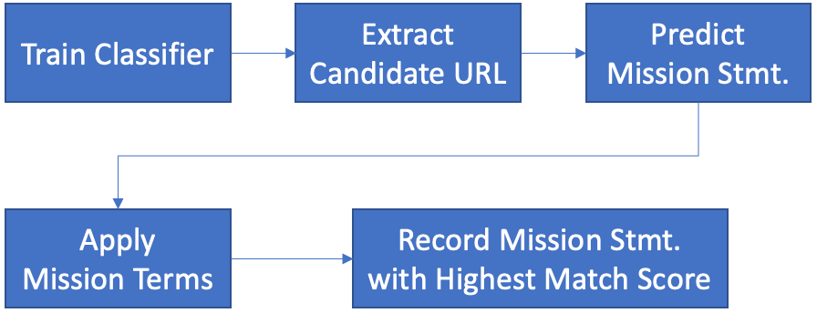

# Mission Statement Detection and Extraction

Mission statement detection and extraction aims to find the page that contains mission statement within the school homepage and extract it from the page using natural language processing (NLP) and machine learning (ML) techniques.  

### Process Overview

------



#### 1. Train Classifier

This component uses existing human-collected mission statements from the school in AZ and NJ to prep text data used for training [One-Class SVM](https://scikit-learn.org/stable/modules/generated/sklearn.svm.OneClassSVM.html). Please refer to [oneclasssvm](oneclasssvm/README.md) folder for training codes and pre-trained model (i.e., joblib).

#### 2. Iterate School Homepages and Extract Candidate URLs from Each School Homepage

This [component](https://gitlab.msu.edu/adsdatascience/schooltext/-/blob/master/mission/candidate_urls.py) exploits [Selenium](https://selenium-python.readthedocs.io/) web automation technique to open each school homepage using the browser and extract candidate URLs (i.e., pages that has potential to contain mission statement) based on various heuristics .

#### 3. Apply Classifier and Predict Mission Statement Candidates

This [component](https://gitlab.msu.edu/adsdatascience/schooltext/-/blob/master/mission/predict_mission_stmt.py) extracts text from the candidate webpages retrieved from previous [extract candidate URL](https://gitlab.msu.edu/adsdatascience/schooltext/-/blob/master/mission/candidate_urls.py) result and apply NLP techniques to prep text. Once texts are prepped for all webpages, pre-trained [One-Class SVM model](https://scikit-learn.org/stable/modules/generated/sklearn.svm.OneClassSVM.html) is utilized to predict mission statements.

#### 4. Apply Mission Terms to Calculate Match Score

This [component](https://gitlab.msu.edu/adsdatascience/schooltext/-/blob/master/mission/check_mission_terms.py) uses pharases and keywords from various qualitative researches on the school mission statements with [spaCy](https://spacy.io/)'s [phraseMatcher](https://spacy.io/api/phrasematcher), to efficiently match and calculate match score for each positively predicted mission statement candidate.

#### 4. Select Highest Match Score and Record Mission Statement

This [component](https://gitlab.msu.edu/adsdatascience/schooltext/-/blob/master/mission/mission_stmt_process.py) sort candidate mission statements in descending order and records highest scored candidate as mission statement

### Example Usage

------

#### 1. Train Classifier

Refer to this [README](https://gitlab.msu.edu/adsdatascience/schooltext/-/blob/master/mission/oneclasssvm/README.md) file

#### 2. Mission Statement Detection & Extraction

Requires ***THREE*** arguments

- **data_dir** (str): Absolute path to data directory where input CSV file resides
  - Classification result will be stored in this directory in the form of "[source file name]_Result.csv"
- **source_data** (str): Name of the CSV formatted source file
  - CSV file is expected in following format:
    - [School Name], [WEBSITE]
- **model_dir** (str): Absolute path to classifier model directory where pre-trained classifier resides

> NOTE: if any of them is missing, program shows error messages with usage information.

```bash
$ python mission_stmt_process.py
Start Time: 2021-07-28 01:38:34.218918
usage: mission_stmt_process.py [-h] data_dir source_data model_dir
mission_stmt_process.py: error: the following arguments are required: data_dir, source_data, model_dir

$ python classification.py -h
Start Time: 2021-07-28 01:39:31.478355
usage: mission_stmt_process.py [-h] data_dir source_data model_dir

positional arguments:
  data_dir     Path to data directory where input file reside
  source_data  CSV formatted source file
  model_dir    Path to model directory where trained OneClassSVM model reside

optional arguments:
  -h, --help   show this help message and exit
```

> NOTE: If any of the directories and/or files do not exist, program terminates and throws error

```bash
$ python mission_stmt_process.py /data/dir source.csv /model/dir
Start Time: 2021-07-29 01:40:27.886372
Traceback (most recent call last):
  File "/Users/jhp/Projects/MSU/schooltext/mission/mission_stmt_process.py", line 31, in <module>
    raise FileNotFoundError(errno.ENOENT, strerror(errno.ENOENT), data_dir)
FileNotFoundError: [Errno 2] No such file or directory: '/data/dir'
```

> NOTE: Since this is a long process, it is highly recommended that you execute this in the background preferably through *screen* (Linux/macOS) type of command

> NOTE: Following command example pipe std/err output to a log file and run it in the background

```bash
$ python mission_stmt_process.py /data/dir source.csv /model/dir >& run.log &
```

### Requirements

------

- Python 3.6 or higher

- [NLTK Data](https://www.nltk.org/data.html) (stopwords)

  > NOTE: Downloading all items in NLTK data can take long. You may use either one of the methods below to avoid this issue.

  - Python Shell

  ```python
  import nltk
  nltk.download('stopwords')
  nltk.download('punkt')
  ```

  - Bash command-line

  ```bash
  $ python -m nltk.downloader stopwords punkt
  ```

- [spaCy](https://spacy.io/) language model ([en_core_web_lg](https://spacy.io/models/en#en_core_web_lg))

  ```bash
  $ python -m spacy download en_core_web_lg
  ```

- Firefox browser and geckodriver

  - `geckodriver` may be downloaded from its [GitHub repository](https://github.com/mozilla/geckodriver/releases).

  - ***macOS 10.15 Catalina*** or higher

    Due to the requirement from Apple that all programs must be notarized, geckodriver will not work on macOS Catalina or higher if you manually download it through another notarized program such as your browser. Instead please use [Homebrew](https://brew.sh/) to install `geckodriver`

    ```bash
    $ brew install geckodriver
    ```

- Additional python packages

  ```bash
  $ pip install -r requirements.txt
  ```

### Recommended Environment

------

Since active classification task could easily take 6+ hrs depending on the size of the school list, it is advisable that the classification task to be run on elsewhere other than your own machine. In following instruction, we provision a virtual machine (VM) in Azure cloud environment to run our classification task.

1. Setup Azure VM with Ubuntu 18.04 LTS image

- Follow instruction in [AzureVM markdown](AzureVM.md) document in the current folder

2. Setup RDP access on Azure Ubuntu VM

- Follow instruction in [UbuntuRDP markdown](UbuntuRDP.md) document in the current folder

3. Setup Python DEV environment on Azure Ubuntu VM

- Follow instruction in [PythonEnvSetup markdown](PythonEnvSetup.md) document in the current folder

